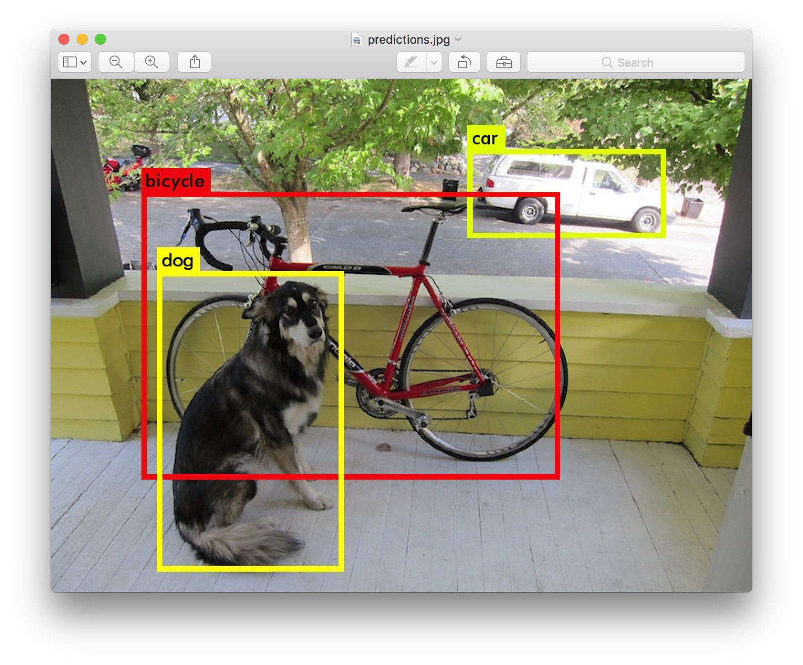

#Real-time Object Detection Using Deep Learning#

You only look once (YOLO) is a state-of-the-art, real-time object detection system. On a Titan X it processes images at 40-90 FPS and has a mAP on VOC 2007 of 78.6% and a mAP of 48.1% on COCO test-dev.

You can find more technical details from the following paper:
["YOLO9000: Better, Faster, Stronger"](https://arxiv.org/abs/1612.08242).

## Detection Using A Pre-Trained Model

This post will guide you through detecting objects with the YOLO system using a pre-trained model. If you don't already have Darknet installed, you should [do that first](https://pjreddie.com/darknet/install/). Or instead of reading all that just run:

--
1) git clone https://github.com/pjreddie/darknet
2) cd darknet
3) make

You already have the config file for YOLO in the cfg/ subdirectory. You will have to download the pre-trained weight file here (258 MB). Or just run this:

--
wget https://pjreddie.com/media/files/yolo.weights

Then run the detector!

--
./darknet detect cfg/yolo.cfg yolo.weights data/dog.jpg

#Darknet#
Darknet is an open source neural network framework written in C and CUDA. It is fast, easy to install, and supports CPU and GPU computation.

For more information see the [Darknet project website](http://pjreddie.com/darknet).

